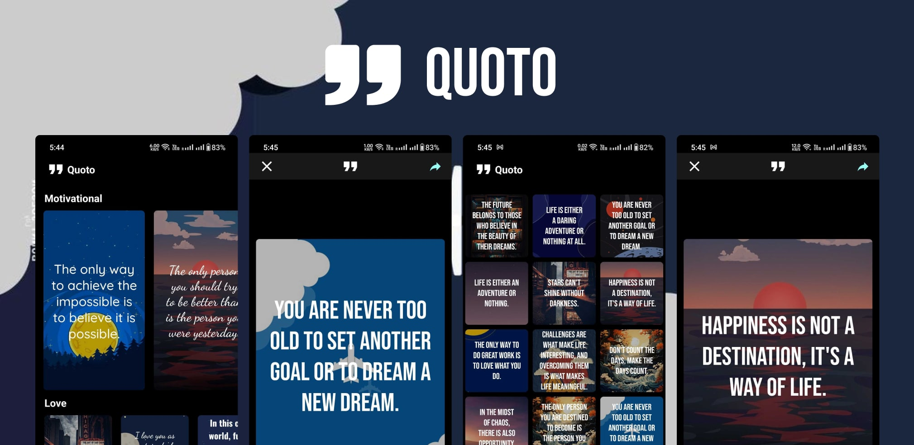

# Quoto App

Welcome to the Quoto app repository! Quoto is a mobile application focused on creating positive and amazing quotes. With Quoto, users can easily create quotes using templates or their own creative ideas. The app is built using React Native, providing a smooth and intuitive user experience.

## Features

- **Quote Creation**: Users can create inspiring quotes using predefined templates or by starting from scratch with their own content.

- **Template Selection**: Quoto offers a variety of templates to choose from, making it easy for users to find the perfect style for their quotes.

- **Customization**: Users can customize their quotes by changing fonts, colors, backgrounds, and more, allowing for personalized and unique creations.

- **Image Sharing**: Quoto allows users to share their quotes as images on social media platforms or with friends, spreading positivity and creativity.

- **Offline Support**: The app utilizes `react-native-fs` and `react-native-mmkv-storage` to ensure seamless offline functionality, letting users create quotes even without an internet connection.

- **Notifications**: Quoto uses the `@notifee/react-native` package to send motivational notifications, reminding users to stay creative and positive.

## Dependencies

Quoto relies on the following libraries and packages:

- `@notifee/react-native`: For handling notifications and keeping users engaged.

- `@react-navigation` (various packages): To manage navigation within the app, providing a smooth flow between different screens.

- `nativewind`: A utility for styling React Native components using Tailwind CSS syntax, ensuring consistent and responsive designs.

- `react-native-fs`: A library for working with the device's file system, enabling offline functionality for the app.

- `react-native-mmkv-storage`: Used for efficient storage and retrieval of data, contributing to the offline capabilities of the app.

- `react-native-pager-view`: For implementing swipeable views, enhancing the user experience when navigating through different screens.

- `react-native-permissions`: To manage permissions required by the app, ensuring smooth integration with device features.

- `react-native-safe-area-context`: For handling safe areas and ensuring content is properly displayed on various devices.

- `react-native-screens`: Enhances navigation performance by using native navigation views.

- `react-native-share`: Enables users to easily share their created quotes as images on different platforms.

- `react-native-slider`: Provides a customizable slider component for the app's UI.

- `react-native-tab-view`: Used to create tab-based navigation within the app.

- `react-native-vector-icons`: Offers a wide range of icons for use in the app's UI.

- `react-native-view-shot`: Allows capturing screenshots of quotes for sharing.

- `toggle-switch-react-native`: Provides toggle switch components for the app's settings.

## Installation

1. Clone this repository to your local machine.

2. Navigate to the project directory and run `npm install` to install the necessary dependencies.

3. Run `npx react-native run-android` to start the app on an Android emulator or device. Use `npx react-native run-ios` for iOS.

## Usage

- Upon launching the app, users are presented with various options to create their own quotes.

- They can choose to start from scratch or select a template that resonates with them.

- After creating the quote, users can customize its appearance using the provided tools.

- Quotes can be saved, shared on social media, or downloaded for offline use.

## Contributing

We welcome contributions from the open-source community! If you'd like to contribute to Quoto, please follow our [contribution guidelines](CONTRIBUTING.md).

## License

Quoto is released under the [MIT License](LICENSE).

---

Thank you for choosing Quoto app! We hope you find joy and inspiration in creating beautiful quotes that spread positivity and creativity.